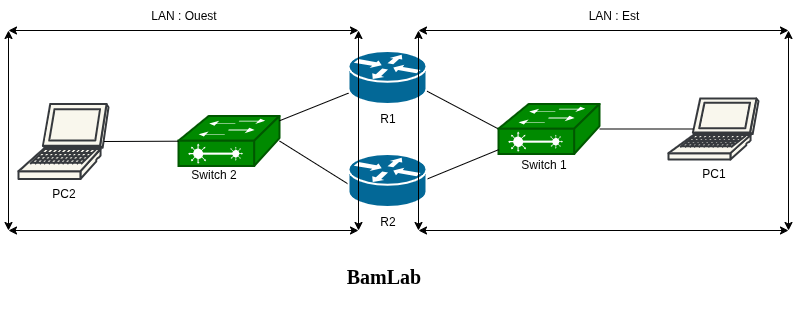
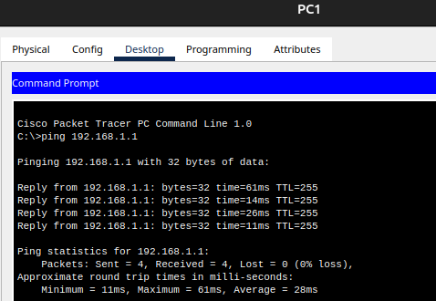
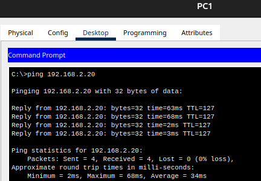
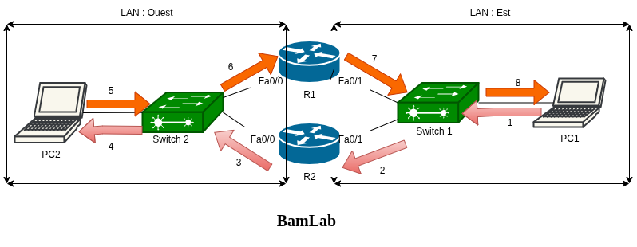
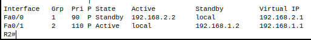
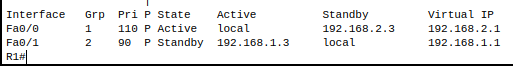
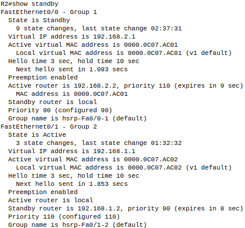

# Résilience Réseau avec FHRP (HSRP) 

Imagine que dans ton réseau, les équipements n'ont qu'une seule passerelle par défaut.  
Et ce routeur tombe…

**Résultat ?** Plus d’accès à Internet ou aux autres réseaux.  
**Mais bonne nouvelle : on peut contourner ça.**

## La solution : FHRP (First Hop Redundancy Protocol)

L’idée, c’est de créer une passerelle virtuelle partagée entre plusieurs routeurs.

Dans notre exemple, on va utiliser deux routeurs Cisco **(R1 et R2)** pour assurer la continuité :
- Si l’un des deux tombe, l’autre prend automatiquement le relais.
- Les PC ne voient qu’une seule passerelle logique : **la VIP (Virtual IP)**.

## Les protocoles FHRP les plus connus

| Protocole | Nom complet                        | Propriétaire    |
| --------: | ---------------------------------- | --------------- |
|      HSRP | Hot Standby Router Protocol        | Cisco           |
|      VRRP | Virtual Router Redundancy Protocol | Standard ouvert |
|      GLBP | Gateway Load Balancing Protocol    | Cisco           |


## **Démonstration avec Cisco Packet Tracer**

### Topologie



**Protocole utilisé : HSRP**

---

## Détails des connexions

Pour le LAN OUEST

| Équipement | Connecté à        | Adresse IP   |
| ---------- | ----------------- | ------------ |
| PC2        | Switch 2          | 192.168.2.20 |
| R1         | Switch  2 (Fa0/0) | 192.168.2.2  |
| R2         | Switch 2 (Fa0/0)  | 192.168.2.3  |
| VIP        | Adresse virtuelle | 192.168.2.1  |

Pour le LAN EST

| Équipement | Connecté à        | Adresse IP   |
| ---------- | ----------------- | ------------ |
| PC1        | Switch 1          | 192.168.1.10 |
| R1         | Switch  1 (Fa0/1) | 192.168.1.2  |
| R2         | Switch 1 (Fa0/1)  | 192.168.1.3  |
| VIP        | Adresse virtuelle | 192.168.1.1  |


## Comment ça fonctionne ?

Pour le vlan EST :

- Les PC utilisent **192.168.1.1** comme passerelle par défaut.
- **R1** et **R2** utilisent HSRP pour simuler cette passerelle virtuelle.
- À un instant donné, **un seul routeur est actif** et détient la VIP.
- En cas de panne de ce routeur, **l’autre prend automatiquement le relais**.


## Points importants

- La **VIP** est associée à une **adresse MAC virtuelle**.
- Le routeur actif **annonce cette MAC** au réseau.
- Le switch **envoie les trames** vers celui qui détient cette MAC.
- **La bascule est automatique** et **transparente pour les utilisateurs**.


## **Configuration HSRP étape par étape**

Je vais créer plusieurs groupes FHRP.

##### Pourquoi ?

Un **groupe HSRP = un sous-réseau / VLAN**.

| Réseau    | R1     | R2     | VIP         | Groupe HSRP |
| --------- | ------ | ------ | ----------- | ----------- |
| LAN EST   | actif  | backup | 192.168.1.1 | groupe 1    |
| LAN OUEST | backup | actif  | 192.168.2.1 | groupe 2    |


## Exemple de configuration simplifiée

### Sur **R1** :

````cisco
interface Fa0/0
 ip address 192.168.2.2 255.255.255.0
 standby 1 ip 192.168.2.1
 standby 1 priority 110
 standby 1 preempt

interface Fa0/1
 ip address 192.168.1.2 255.255.255.0
 standby 2 ip 192.168.1.1
 standby 2 priority 90
 standby 2 preempt
````

### Sur **R2** :

```cisco
interface Fa0/0
 ip address 192.168.2.3 255.255.255.0
 standby 1 ip 192.168.2.1
 standby 1 priority 90
 standby 1 preempt

interface Fa0/1
 ip address 192.168.1.3 255.255.255.0
 standby 2 ip 192.168.1.1
 standby 2 priority 110
 standby 2 preempt
```

## Notes : 

Dans HSRP, chaque routeur a une **priorité** (par défaut : 100).
Le **routeur avec la plus haute priorité devient actif**.

- `priority 90` : ce routeur aura **moins de chance** d’être actif si un autre routeur a une priorité plus haute. C'est le cas ici.
- `priority 110` : ce routeur est **préféré comme actif**.
- `preempt` : permet au routeur de **reprendre le rôle actif** si sa priorité est supérieure à celle du routeur actuellement actif.

> **Sans `preempt`**, un routeur avec une priorité plus élevée ne redeviendra **jamais actif** après un retour en ligne — sauf si on redémarre tout.


## Ce qu’on peut tester

- `ping 192.168.1.1` depuis les PC.

|  |  |
| ------------------------------------------------------------ | -------------------------------------- |


- Lance un **ping** depuis le PC1 vers le PC2 (un équipement **au-delà des routeurs**.)
  

Lorsque le PC1 envoie un ping vers le PC2, la requête passe par le **chemin 1 → 2 → 3 → 4** car **l’interface Fa0/1 du routeur R2** a une **priorité plus élevée (110)** que celle de **Fa0/1 sur R1 (90)**. R2 devient donc **le routeur actif** sur ce segment.

En revanche, pour la **réponse du PC2 vers le PC1**, le chemin suivi est **5 → 6 → 7 → 8**. Cette fois, c’est **l’interface Fa0/0 de R1** qui a une **priorité plus élevée** que celle de R2 sur le même segment, ce qui fait de **R1 le routeur actif** pour le retour.



**HSRP** ne fait pas de *vrai* load balancing (comme **GLBP**), mais on obtient une **répartition intelligente du trafic** grâce à l’usage de **2 groupes HSRP** et des **priorités différentes**.

Dans cette configuration :

1. **Pour le LAN EST** : **R1** est en veille (priorité 90) et **R2** est actif (priorité 110) 

2. **Pour le LAN OUEST** : **R1** est actif (priorité 110)  et **R2** est en veille (priorité 90)

### Résultat : 

**R2 gère le trafic sortant du LAN EST (192.168.2.0/24)** et **R1 celui du LAN OUEST (192.168.1.0/24)**


C’est ce qu’on appelle du **"load sharing" **ou **"pseudo load balancing"**, une forme simple de **répartition de charge par LAN/VLAN**, grâce à **HSRP + priorités + preempt**.


- Désactiver l’interface **Fa0/0 de R1** (`shutdown`) → observer si **R2 prend le relais**.

- Relancer l’interface → **R1 redevient actif** (grâce à `preempt`).

Passe en **mode simulation** pour observer le basculement étape par étape.
**Attention** : le basculement peut prendre quelques secondes.

- Sur les routeurs, utiliser `show standby brief` pour vérifier les rôles.

|  |  |
| ------------------------------------------------------ | ------------------------------------------------------ |

**Analyse HSRP avec `show standby brief`** :

1. Pour R2, sur **Fa0/0**, le routeur est en **Standby** dans le groupe 1, car R2 (192.168.2.2) a une **priorité plus élevée**. 

- Pour R2, sur **Fa0/1**, le routeur est **Actif** dans le groupe 2, car il a la **priorité la plus haute (110)** et le rôle **preempt** est activé (P).
- Le champ `local` indique que ce routeur détient le rôle (Actif ou Standby) sur l’interface concernée.
- La bascule automatique est possible grâce à la configuration de `preempt`.

**Conclusion** : la répartition des rôles HSRP est cohérente avec les priorités configurées.


## Vérification des rôles

Commande utile :

```bash
show standby
show standby brief
```

Le resultat de la commande show standby sur R2 est montré par la capture suivante : *


On voit :

* Fa0/0 fait partie du groupe 1 (connectée au LAN OUEST) et Fa0/1 du groupe 1 (connectée au LAN EST),
* Fa0/0 est en standby et Fa0/1 est active,
* VIP Fa0/0→ 192.168.2.1 et VIP Fa0/0→ 192.168.1.1 
* Adresse Mac virtuelle de Fa0/0 → 0000.0C07.AC01
* L'adresse IP du routeur actif pour le groupe 1 (LAN OUEST) → 192.168.2.2 (L'IP réelle de l'interface Fa0/0 de R1)
* etc.


**Analyse HSRP – Synthèse des rôles et paramètres montrés par la capture (faites sur R2):**

- **Interfaces & Groupes :**
  - `Fa0/0` → **Groupe 1**, connecté au **LAN OUEST**
  - `Fa0/1` → **Groupe 2**, connecté au **LAN EST**
- **Rôles des interfaces de R2: **`Fa0/0` est en **Standby** et `Fa0/1` est **Active**
- **Virtual IPs (VIPs) :**
  - Groupe 1 (Fa0/0) → `192.168.2.1`
  - Groupe 2 (Fa0/1) → `192.168.1.1`
- **Adresse MAC virtuelle :** Groupe 1 → `0000.0C07.AC01` et Groupe 2 → `0000.0C07.AC02`
- **Routeurs actifs :**
  - Pour le **LAN OUEST (Groupe 1)** → Actif = `192.168.2.2` (interface Fa0/0 de **R1**)
  - Pour le **LAN EST (Groupe 2)** → Actif = `local` → ce routeur lui-même (**R2** ici)

**Conclusion :** Les rôles HSRP sont bien répartis : chaque routeur est actif sur un LAN et standby sur l'autre, assurant une **répartition équilibrée du trafic (load sharing)**.


## Extensions possibles

* Refaire le TP avec **VRRP** (standard ouvert, fonctionne aussi sur des équipements non Cisco).
* Tester **GLBP** pour répartir le trafic automatiquement entre plusieurs routeurs.
* Ajouter un **protocole de routage dynamique** (ex : EIGRP ou OSPF) pour une **redondance complète de couche 3**.
